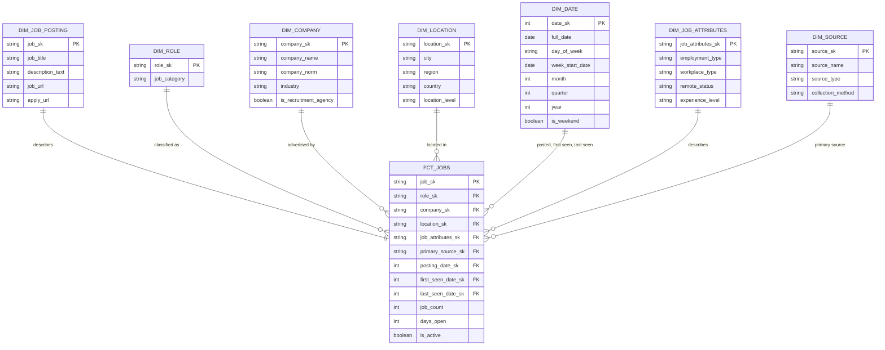

# Data Model — Job Market Data Pipeline (Saudi Arabia)

Target dimensional model for the curated job-market dataset, designed before the intermediate
and marts layers were built, following the dimensional modeling process:
business questions → business process → grain → dimensions → measures → validation.

| | |
|---|---|
| **Pattern** | Star schema: 1 fact table (`fct_jobs`, an accumulating snapshot) with 7 dimensions |
| **Approach** | ELT — raw data loaded untouched into Snowflake, transformed with dbt |
| **Dimension history** | Type 1 (overwrite). A posting's lifecycle is kept as dates on the fact |
| **Observation window** | September 2026 — our collections in September, starting on 9 September |
| **Status** | Staging built on two snapshots · intermediate and marts designed (see Section 15) |

---

## 1. Analytics goal

Give job seekers, career centers, and workforce analysts a reliable view of hiring demand in
Saudi Arabia: where the jobs are, who is hiring, what kind of roles are open, and how demand
changes over time.

Data quality is not modelled as a business goal. It is measured on the pipeline itself, through
dbt tests and the RAW-to-staging audit (Section 12).

---

## 2. Business questions

### Time frame

Every question names its period, so each has one correct, checkable answer. Two different
kinds of date are used, and each question says which one it means:

> **Observation window: September 2026** — the collections we made in September, starting on
> 9 September. "During September 2026" in a question means during these collections: openings
> that were advertised and removed before our first collection were never observed. A later
> collection in September is included without changing any question.
>
> - **Being advertised** in a window: the opening was live on a job board in at least one of our
>   collections in that window (`first_seen_at` on or before the window end, and `last_seen_at`
>   on or after the window start). This says nothing about when the job was **posted**: a job
>   posted in June and still live on 16 September was being advertised in the window.
>   Every collected opening meets this condition. Used by Q1 to Q7.
> - **Posted** in a period: the opening's own posting date falls in the period. Openings
>   without a posting date (all of Jooble) are left out, because the date we first observed them
>   is a collection date, not a posting date. Used by Q8 and Q9.
> - **Taken down** in a window: the opening disappeared from its employer's job board between
>   two of our collections (Section 7.2). Only employer boards (ATS sources) give this evidence; a job
>   missing from an aggregator's search results may simply not have been returned. Used by Q9.

### Questions

One idea per question.

| # | Business question | Data availability |
|---|---|---|
| Q1 | How many unique job openings were being advertised in Saudi Arabia during September 2026? | All sources |
| Q2 | Which 10 Saudi cities had the most job openings being advertised during September 2026? | All sources, after city standardization; openings with no known city are excluded |
| Q3 | Which 10 employers, excluding recruitment agencies, were advertising the most job openings in Saudi Arabia during September 2026? | All sources; agencies flagged in `dim_company` (Section 6) |
| Q4 | Which job categories had the most job openings being advertised in Saudi Arabia during September 2026? | All sources, via title keywords |
| Q5 | What percentage of the job openings being advertised in Saudi Arabia during September 2026 were full-time? | Not available for Jooble; its openings are Unknown and excluded from the percentage |
| Q6 | What percentage of the job openings being advertised in Saudi Arabia during September 2026 were remote? | Remote status known for Ashby, Workable, SmartRecruiters and JSearch; not available for Jooble or Greenhouse, excluded from the percentage |
| Q7 | Which experience level was requested most by job openings being advertised in each Saudi region during September 2026? | Workable and SmartRecruiters only (Section 14) |
| Q8 | How many new job openings were posted in Saudi Arabia in each week of September 2026? | ATS sources only: the only sources collected on the same dates through the whole month (JSearch's latest posting date is 10 September; Jooble has no posting date) |
| Q9 | For job openings taken down during September 2026, what was the median number of days between their posting date and their removal? | ATS sources with two snapshots (130 openings taken down); median, because some postings date back to 2018 and would distort an average |

Salary is not asked about: no ATS source has a salary field, and salary appears in the titles
of only 2 JSearch listings (Section 14).

---

## 3. Business process

> **Job opening publication:** an employer publishes a job opening, and the pipeline observes it
> on one or more sources until it disappears.

The star schema measures this process at the level of the unique job opening.

---

## 4. Grain

> **`fct_jobs`: one row represents one unique job advertisement in one Saudi location, after
> the same advertisement found on several sources has been merged into one.**

- **What is counted.** Sources do not report how many vacancies an advertisement covers, so a
  row is one advertisement, not one vacancy. "Job opening" in this document means this.
- **Location.** A city when the source names one; otherwise the region, or Saudi Arabia as a
  whole (Section 6, `dim_location`).
- **Expected rows.** Fewer than the 12,928 staged listings; the difference is the cross-source
  overlap resolved by matching (Section 8).
- **Why the unique advertisement and not the listing.** Counting listings would count a job
  published on three sources three times, so "how many jobs were advertised in Riyadh?" would be
  wrong. The link from each job back to its listings is kept in `int_jobs_matched` for lineage.
- **Multi-city roles.** Workable publishes a role open in several cities as one listing per city,
  and each stays its own row. A listing from another source that names several cities in one
  text (e.g. `"Riyadh | Dubai"`) is assigned the first Saudi city it names (Section 14).

### Fact table type

`fct_jobs` is an **accumulating snapshot**: one row per job opening for its whole life, holding
several dates (posted, first seen, last seen) that are filled in as they happen. It is rebuilt
in full on every run. A periodic snapshot (one row per job per collection date) would be more
precise for week-by-week stock questions, but with two to three collections it adds nothing.

---

## 5. Schema diagram



Rendered image for documents that cannot display Mermaid: `docs/schema_diagram.png`.

---

## 6. Dimensions

Every dimension contains exactly one **Unknown member** (`'-1'`, or `-1` for `dim_date`). A fact
row whose value is missing points to it instead of carrying a null foreign key, so every
`relationships` test holds and reports can group missing values explicitly.

### `dim_job_posting` — the advertisement itself

One row per job, 1:1 with `fct_jobs`. It holds the long descriptive text so the fact table stays
narrow.

| Column | Type | Description |
|---|---|---|
| `job_sk` | STRING (PK) | Job key from matching (Section 8.3) |
| `job_title` | STRING | Title from the representative listing |
| `description_text` | STRING | Plain-text description from the representative listing |
| `job_url` / `apply_url` | STRING | From the representative listing |

### `dim_role` — what kind of role

A category is shared by thousands of openings, so it is a dimension of its own rather than a
column of the 1:1 posting table.

| Column | Type | Description |
|---|---|---|
| `role_sk` | STRING (PK) | Hash of `job_category` |
| `job_category` | STRING | From title keywords (`seed_job_categories`), 18 categories plus `'Other'` |

### `dim_company` — who is advertising

| Column | Type | Description |
|---|---|---|
| `company_sk` | STRING (PK) | Hash of `company_norm` |
| `company_name` | STRING | Display name: the standard name from `seed_company_aliases` when listed there, otherwise the name from the highest-priority listing |
| `company_norm` | STRING | Matching key: legal suffixes and labels removed, then mapped through `seed_company_aliases` |
| `industry` | STRING | Most frequent industry across the company's listings (Workable / SmartRecruiters only) |
| `is_recruitment_agency` | BOOLEAN | From `seed_company_aliases`. Agencies advertise on behalf of clients, so Q3 excludes them |

`seed_company_aliases` maps every known spelling of a company to one standard name, and flags
agencies. It covers:

- the eleven Ashby board slugs (e.g. `lilt-production` → `Lilt`), because Ashby's API returns no
  company name;
- Arabic and English spellings of the same company;
- placeholders such as `Private Company` or `Confidential`, mapped to Unknown;
- aliases and agencies found among the 60 largest companies by listing count, which cover 58% of
  listings. `Private Company` alone is 13.6% of listings (Jooble and JSearch).

### `dim_location` — where

Hierarchy: country → region → city.

| Column | Type | Description |
|---|---|---|
| `location_sk` | STRING (PK) | Hash of `city`, `region`, `location_level` |
| `city` | STRING | Standard city from `seed_city_mapping`; `'Unknown'` when the source names no city |
| `region` | STRING | Standard region (13 Saudi regions); `'Unknown'` when not known |
| `country` | STRING | `'SA'` |
| `location_level` | STRING | `city`, `region` or `country`: the most precise level the source gave |

A listing that names only a region (e.g. Jooble's `"Al Qassim Region"`) keeps its region, so it
still counts in region-level answers (Q7). A listing that says only "Saudi Arabia", or is remote
with no city, is at `country` level. The Unknown member is used only when nothing is known.

### `dim_date` — when

Generated with `dbt_utils.date_spine` from the earliest date in any role (usually an old posting
date) to the latest collection date, so every `relationships` test on a date key passes.
**Role-playing dimension:** used for posting date, first-seen date and last-seen date.

| Column | Type | Description |
|---|---|---|
| `date_sk` | INT (PK) | `YYYYMMDD` |
| `full_date` | DATE | |
| `day_of_week` | STRING | |
| `week_start_date` | DATE | The Sunday that starts the date's week, matching the Saudi working week. Weekly grouping (Q8) uses this, not a week number, so weeks never collide across years |
| `month` / `quarter` / `year` | INT | |
| `is_weekend` | BOOLEAN | Friday and Saturday |

### `dim_source` — where the representative listing was collected

Six rows. No business question groups by source, but the dimension lets any question be filtered
by source, records where each opening's representative listing came from, and restricts Q9 to
employer boards.

| Column | Type | Description |
|---|---|---|
| `source_sk` | STRING (PK) | Hash of `source_name` |
| `source_name` | STRING | `ashby`, `workable`, `greenhouse`, `smartrecruiters`, `jsearch`, `jooble` |
| `source_type` | STRING | `ATS` (employer job boards) or `Aggregator` (query-based search engines) |
| `collection_method` | STRING | `Company board API` or `Query matrix API` |

### `dim_job_attributes` — employment details (junk dimension)

Four short, low-cardinality attributes combined into one dimension, instead of four
single-column dimensions. One row per observed combination. The combination in which all four
are Unknown **is** the Unknown member (`'-1'`); there is no second all-Unknown row.

| Column | Type | Values |
|---|---|---|
| `job_attributes_sk` | STRING (PK) | Hash of the four attributes; `'-1'` when all four are Unknown |
| `employment_type` | STRING | `Full-time`, `Part-time`, `Contract`, `Internship`, `Temporary`, `Volunteer`, `Other`, `Unknown` |
| `workplace_type` | STRING | `Remote`, `Hybrid`, `OnSite`, `Unknown` |
| `remote_status` | STRING | `Remote`, `Not remote`, `Unknown`. Workable and JSearch only say whether a job is remote; a `false` there cannot be split into Hybrid or OnSite, so `workplace_type` is `Unknown` but `remote_status` is `Not remote`. Used for Q6 |
| `experience_level` | STRING | Closed list: `Internship`, `Entry`, `Associate`, `Mid-Senior`, `Director`, `Executive`, `Unknown`. Every raw value is mapped by `seed_experience_levels` (Section 10); a raw value missing from the seed fails an `accepted_values` test |

---

## 7. Facts and measures

### 7.1 `fct_jobs`

| Column | Kind | Logic |
|---|---|---|
| `job_sk` | PK | From `int_jobs_matched` (Section 8.3) |
| `role_sk`, `company_sk`, `location_sk`, `job_attributes_sk` | FK | Chosen field by field across the job's listings (Section 8.4) |
| `primary_source_sk` | FK | Source of the representative listing |
| `posting_date_sk` | FK (role: posted) | Earliest posting date across the job's listings; `-1` when none has one |
| `first_seen_date_sk` | FK (role: first seen) | `min(first_seen_at)` across the job's listings |
| `last_seen_date_sk` | FK (role: last seen) | `max(last_seen_at)` across the job's listings |
| `job_count` | Measure — **additive** | `1` per row |
| `days_open` | Measure — **non-additive** | Days from the posting date to the last date the opening was observed. Null when there is no posting date. Summarized with a median (or average), never summed. For openings still advertised it means "open so far" |
| `is_active` | Flag | `true` when the opening was present in the latest collection of at least one of its listings' boards (Section 7.2) |

The three date roles make every question's time frame answerable: "being advertised" uses first
seen and last seen, "posted" uses the posting date, and "taken down" uses last seen with
`is_active` (Section 2).

### 7.2 Lifecycle: what `is_active = false` means

No source reports whether a posting was filled, closed, or deleted. The pipeline can only see
that a posting **disappeared**. The model records the disappearance and does not claim a reason.

| Source type | `is_active = false` means | Used for Q9 |
|---|---|---|
| ATS | Missing from the latest collection of its own board. A board's file lists every open job, so this is direct evidence the posting was taken down | Yes |
| Aggregator | Not returned by any query within 7 days of that source's latest collection. Queries do not return every job on every run, so this is weak evidence | No |

The removal date is known only to within the gap between two collections: `last_seen_date` is
the last day it was still seen.

### 7.3 Non-additive values

Percentages and averages are recalculated from their components, never summed or averaged across
groups:

| Value | Formula |
|---|---|
| Share of full-time openings (Q5) | `SUM(job_count)` where `employment_type = 'Full-time'` ÷ `SUM(job_count)` where `employment_type <> 'Unknown'` |
| Share of remote openings (Q6) | `SUM(job_count)` where `remote_status = 'Remote'` ÷ `SUM(job_count)` where `remote_status <> 'Unknown'` |
| Median days open (Q9) | `MEDIAN(days_open)` over the filtered rows, with `AVG` shown beside it for reference — never an average of averages |

---

## 8. Cross-source matching specification

Builds `int_jobs_matched`: assigns one `job_sk` to every listing of the same real job.
Matching is **heuristic** — sources share no common identifier — so the rules are designed to be
explainable and measurable.

### 8.1 The rule that is never broken

> **Two listings from the same publisher are never merged.**

The publisher is whoever actually put the advertisement online:

| Source type | Publisher |
|---|---|
| ATS | The employer's board (the landed file) |
| JSearch | `job_publisher` (e.g. LinkedIn, Jobrapido) |
| Jooble | `underlying_source` (e.g. jobleads.com) |

If an employer's board lists two postings with the same title and city under different IDs, the
employer says they are two openings, so they stay two. Aggregators are different: they re-collect
from other sites, so the same job can reach JSearch once through LinkedIn and once through
Jobrapido, under two different `job_uid`s. Those two may be merged; two listings that both came
through LinkedIn may not. This prevents the worst error, under-counting real jobs, without
double-counting aggregator copies.

### 8.2 Matching keys (built in `int_job_listings`)

| Key | Rules | Example |
|---|---|---|
| `title_norm` | Lower-case, punctuation removed, bracketed notes removed, hiring noise and location words removed, `sr` / `jr` / `mgr` expanded | `"Senior Oil & Gas Safety Officer (Saudi National)"` → `"senior oil gas safety officer"` |
| `company_norm` | Lower-case, punctuation removed, legal suffixes and labels removed, then mapped through `seed_company_aliases` | `"Qiddiya Investment Company"` → `"qiddiya investment"` |
| `city_std` | Seed lookup on the city field, else on the location text | `جدة`, `Jiddah` → `Jeddah`; Greenhouse `"Riyadh, KSA"` → `Riyadh` |

### 8.3 Matching rule and job key

**Exact match only:** listings match when `title_norm`, `company_norm` and `city_std` are all
equal and not null. Listings missing a company or a city are never matched; each stays its own
job.

**No fuzzy matching.** A Jaro-Winkler threshold was tested and rejected: it scores
`data analyst` against `data analyst intern` at 92 and `project engineer` against
`project engineer trainee` at 93, because it rewards a shared beginning and the word that
separates two roles comes last. Exact matching after normalization misses some true duplicates;
the reported overlap is therefore a lower bound (Section 8.5).

**Pairing inside a group.** When a group holds several listings from one publisher (e.g. two
from the same Workable board and one from Jooble), listings are ranked within each publisher by
posting date, then first-seen date, then `source_record_sk`, and paired rank to rank, which keeps
the rule in Section 8.1 deterministic.

**Stable key.** `job_sk` is the `source_record_sk` of the earliest listing in the job's group
(earliest first-seen date, ties broken by `source_record_sk`). It does not change when
normalization rules change or when a later listing joins the group, so anything stored against
a `job_sk` — such as the manually reviewed precision sample — survives a rebuild.

### 8.4 Survivorship — which value each field takes

When listings match, one listing represents the job, chosen by `source_priority`:
Workable → SmartRecruiters → Ashby → Greenhouse (employer-published) → JSearch → Jooble
(snippet-only descriptions). Each field then follows its own rule:

| Field | Rule |
|---|---|
| Title, description, URLs, `primary_source_sk` | From the representative listing |
| `role`, `company`, `location`, `employment_type`, `workplace_type`, `remote_status`, `experience_level` | First non-Unknown value in `source_priority` order |
| `posting_date` | Earliest posting date across the listings |
| `first_seen_at` / `last_seen_at` | Earliest / latest across the listings |
| `industry` (on `dim_company`) | Most frequent value; ties broken by `source_priority` |
| `is_active` | `true` if any listing is active |

Example: a job whose representative listing is from Workable (no remote signal beyond
`telecommuting = false`) and which also appears on JSearch with `job_is_remote = true` takes
`remote_status = 'Not remote'` from Workable, because Workable comes first and its value is known.

### 8.5 Measuring matching quality

| Check | Method |
|---|---|
| **Precision** | Manual review of 40 randomly sampled matches; reported as "X of 40 correct" |
| **Rule 8.1** | Singular dbt test: no `job_sk` holds two listings from the same publisher |
| **Coverage** | Every staged listing belongs to exactly one `job_sk` |
| **Independent evidence** | JSearch `job_publisher` and Jooble `underlying_source` sometimes name an ATS (e.g. `smartrecruiters.com`); these listings are checked for a match |
| **Recall** | Cannot be measured without a shared identifier. The reported overlap is a **lower bound** |

### 8.6 Risks

| Risk | Effect | Mitigation |
|---|---|---|
| Company names differ between sources (Arabic / English, abbreviations) | Missed matches: matching only compares listings of the same company, so an unresolved company blocks all of its jobs from matching | `seed_company_aliases`, built from the 60 largest companies; share of listings resolved through the seed is reported |
| Recruitment agencies post on behalf of clients | No match with the client's own listing; agencies would dominate Q3 | `is_recruitment_agency`; Q3 excludes agencies |
| Very generic titles (`"Sales Executive"`) | Possible false merges | Exact match within the same company and city only |

---

## 9. Validation against the business questions

"Advertised in the window" below means `first_seen_date_sk <= 20260930` and
`last_seen_date_sk >= 20260901` (Section 2).

| # | Question | How the model answers it |
|---|---|---|
| Q1 | Openings advertised, Sep 2026 | `SUM(job_count)` from `fct_jobs`, advertised in the window |
| Q2 | Top 10 cities, Sep 2026 | Q1 grouped by `dim_location.city` where `location_level = 'city'`, top 10 |
| Q3 | Top 10 employers, Sep 2026 | Q1 where `dim_company.is_recruitment_agency = false`, grouped by `company_name`, top 10 (Unknown excluded) |
| Q4 | Job categories, Sep 2026 | Q1 grouped by `dim_role.job_category` |
| Q5 | Share full-time, Sep 2026 | Q1 split by `dim_job_attributes.employment_type`; full-time ÷ all known types |
| Q6 | Share remote, Sep 2026 | Q1 split by `dim_job_attributes.remote_status`; remote ÷ (remote + not remote) |
| Q7 | Top experience level per region, Sep 2026 | Q1 grouped by `dim_location.region` and `dim_job_attributes.experience_level` (Unknown excluded on both); highest count per region |
| Q8 | New openings posted per week, Sep 2026 | `SUM(job_count)` grouped by `dim_date.week_start_date` on `posting_date_sk`, for posting dates in September 2026 (`posting_date_sk <> -1`) and `dim_source.source_type = 'ATS'` on `primary_source_sk` |
| Q9 | Median days from posting to removal, Sep 2026 | `MEDIAN(days_open)` where `is_active = false`, `dim_source.source_type = 'ATS'` on `primary_source_sk`, `last_seen_date_sk` between 20260901 and 20260930, and `posting_date_sk <> -1` |

---

## 10. Source-to-target mapping

| Target table | Target column | Source | Logic |
|---|---|---|---|
| `dim_company` | `company_name` | Ashby: board slug · Workable: `raw_data:name` · Greenhouse: `metadata.Brand`, else `company_name` without "Careers page" · SmartRecruiters: `company.name` · JSearch: `employer_name` · Jooble: `company` | `seed_company_aliases` standard name when listed; otherwise the highest-priority listing's name |
| `dim_company` | `is_recruitment_agency` | `seed_company_aliases` | `false` when the company is not in the seed |
| `dim_company` | `industry` | Workable `industry` · SmartRecruiters `industry.label` | Most frequent value per company |
| `dim_role` | `job_category` | `title_raw` | Keyword lookup in `seed_job_categories`, lowest priority wins; `'Other'` when none match |
| `dim_location` | `city`, `region`, `location_level` | `city_raw` (Workable, SmartRecruiters, JSearch, Ashby address) or `location_raw` text (Greenhouse, Jooble, Ashby) | Whole-word lookup in `seed_city_mapping`, city field before location text. The seed also holds region names with an empty city (`al qassim region` → Qassim), so a region-only text is kept at region level; if nothing matches, country level |
| `dim_job_attributes` | `employment_type` | Ashby `employmentType` · Workable `employment_type` · Greenhouse `metadata['Employment Type']` · SmartRecruiters `typeOfEmployment.label` · JSearch `job_employment_type` | `normalize_employment_type()`; null → Unknown |
| `dim_job_attributes` | `workplace_type` | Ashby `workplaceType` · SmartRecruiters `location.remote` / `hybrid` | SmartRecruiters and Ashby distinguish all three; every other source → Unknown unless remote |
| `dim_job_attributes` | `remote_status` | Ashby `isRemote` · Workable `telecommuting` · SmartRecruiters `location.remote` · JSearch `job_is_remote` | `true` → Remote, `false` → Not remote, missing → Unknown |
| `dim_job_attributes` | `experience_level` | Workable `experience` · SmartRecruiters `experienceLevel.label` | `seed_experience_levels` (below) |
| `dim_job_posting` | `description_text` | `description_plain` from each staging model | `strip_html()`; representative listing |
| `dim_date` | `date_sk` | `posting_date_raw`, `first_seen_at`, `last_seen_at` | `to_char(date, 'YYYYMMDD')::int`; null → `-1` |
| `fct_jobs` | `job_count` | `int_jobs_matched` | `1` per `job_sk` |
| `fct_jobs` | `days_open` | earliest `posting_date`, latest `last_seen_at` | `datediff('day', min(posting_date), max(last_seen_at))` per `job_sk`; null when no listing has a posting date |
| `fct_jobs` | `is_active` | `int_job_listings.is_active` | `boolor_agg` per `job_sk` |

### `seed_experience_levels`

Raw values observed in staging, mapped to the closed list:

| Raw value (Workable / SmartRecruiters) | `experience_level` |
|---|---|
| `Internship` | Internship |
| `Entry level` / `Entry Level` | Entry |
| `Associate` | Associate |
| `Mid-Senior level` / `Mid-Senior Level` | Mid-Senior |
| `Director` | Director |
| `Executive` | Executive |
| `Not Applicable`, empty, null | Unknown |

---

## 11. ELT build steps and load order

| Step | Implementation | Status |
|---|---|---|
| 1. Stage source data | `stg_*` — one model per source: rename, cast, flatten, deduplicate within source, enforce Saudi scope | ✅ Built |
| 2. Join and filter records | `int_job_listings` — union of the six sources | Written; `remote_status` and the publisher column to add before its first run |
| 3. Business rules and standardization | `int_job_listings` — HTML stripping, city / region / category / company / experience standardization through seeds | Seeds loaded and tested; joins to the company and experience seeds to add |
| 4. Derived columns | `int_jobs_matched` — `job_sk`, survivorship, `days_open` | Designed |
| 5. Load dimension tables | `dim_*` | Designed |
| 6. Load fact table | `fct_jobs` | Designed |
| 7. Data quality checks | `dbt test` at every layer | ✅ Staging |

```
raw_* ──> stg_* ──> int_job_listings ──> int_jobs_matched ──> dim_* ──> fct_jobs
                          ▲
       seed_city_mapping ─┤
     seed_job_categories ─┤
    seed_company_aliases ─┤
  seed_experience_levels ─┘
```

---

## 12. Data quality checks

Data quality is measured on the pipeline, not modelled as business questions. It is covered by
the dbt tests below and by the RAW-to-staging audit in Section 12.1.

| Check type | Check | Layer | Status |
|---|---|---|---|
| Row count | RAW → staging counts per source recorded (Section 12.1) | staging | ✅ |
| Row count | `int_job_listings` rows = sum of the six staging models | intermediate | Planned |
| Duplicate | `unique` on every staging key; Workable on shortcode + city | staging | ✅ |
| Duplicate | No `job_sk` holds two listings from the same publisher | matching | Planned |
| Null | `not_null` on keys, `ingest_date`, `is_active`; warning on titles | staging | ✅ |
| Accepted values | `employment_type`, `workplace_type_raw`, `country_raw` | staging | ✅ |
| Seeds | `unique` / `not_null` on every seed key; `accepted_values` on `experience_level` | seeds | ✅ |
| Accepted values | `source_type`, `remote_status`, `experience_level`, `location_level` | intermediate, marts | Planned |
| Scope | Saudi-only filter on Ashby (country field) and Greenhouse (location keywords) | staging | ✅ |
| Business rule | `first_seen_at <= last_seen_at` | staging | ✅ Tested on two snapshots |
| Referential integrity | `relationships` from every fact FK to its dimension | marts | Planned |
| Business rule | `days_open >= 0` when not null; every staged listing belongs to exactly one `job_sk` | marts | Planned |

### 12.1 Pipeline audit — RAW to staging

Recorded 2026-09-25, on two snapshots per ATS source. RAW rows count every landed copy of every
posting across all snapshots.

| Source | Snapshots | RAW rows | Staging rows | Removed | Why removed |
|---|---|---|---|---|---|
| Ashby | 2026-09-16, 2026-09-24 | 94 | 49 | 45 | Same posting in both snapshots; non-Saudi posting (`"Thailand (Remote)"`) |
| Greenhouse | 2026-09-09, 2026-09-24 | 356 | 215 | 141 | Same posting in both snapshots or on two boards; **24 non-Saudi postings** (Dubai, Cairo…) from the unfiltered 2026-09-09 files |
| SmartRecruiters | 2026-09-19, 2026-09-24 | 1,825 | 943 | 882 | Same posting in both snapshots |
| Workable | 2026-09-16, 2026-09-24 | 2,950 | 1,535 | 1,415 | Same posting (shortcode + city) in both snapshots |
| Jooble | 2026-09-09 | 14,010 | 8,262 | 5,748 | Copies from overlapping queries |
| JSearch | 2026-09-10, 2026-09-11 | 3,089 | 1,924 | 1,165 | Copies from overlapping `date_posted` windows |
| **Total** | | **22,324** | **12,928** | **9,396** | |

Status of the staged ATS postings after the second snapshot:

| Source | Staged | Active | Disappeared |
|---|---|---|---|
| Ashby | 49 | 46 | 3 |
| Greenhouse | 215 | 170 | 45 |
| SmartRecruiters | 943 | 917 | 26 |
| Workable | 1,535 | 1,479 | 56 |

Active counts equal the postings each extraction script collected on 2026-09-24.

### 12.2 Supporting table for the quality dashboard (outside the star)

The instructor's guide asks that Power BI reads only the MARTS schema, and accepts a coverage and
quality dashboard as a valid output. If the team builds a quality page, it reads one small table,
`mart_pipeline_quality`, built in MARTS but **not part of the star schema and not driven by the
business questions**: one row per source with listings, the share of each key field that is
filled, and the listings merged by matching. If no quality page is built, this table is not
needed.

---

## 13. Design decisions

| Decision | Reason |
|---|---|
| Star schema with one fact table | Simplest model for reporting and BI; one grain (the unique advertisement) answers every business question |
| Accumulating snapshot | One row per opening for its whole life, with its dates as columns; enough for questions over one month |
| A stated period in every question | Each question has one correct, checkable answer; the three date roles on the fact define advertised, posted and taken down |
| One idea per question | Each question maps to one measure and one grouping, so each result is a single number or ranking |
| Data quality outside the model | Completeness and removal counts describe the pipeline, not the job market; they are measured by dbt tests and the audit in Section 12.1 |
| `dim_job_posting` holds titles and descriptions | Long text in a fact table signals a missing dimension |
| `dim_role` separate from `dim_job_posting` | A category is shared by many openings; it is a dimension, not a per-job detail |
| Junk dimension for employment details | Four low-cardinality attributes; single-column dimensions are avoided |
| Closed vocabularies through seeds | Experience levels, categories, companies and cities are reviewable in Git, and an unmapped value fails a test instead of passing silently |
| Surrogate keys from `dbt_utils.generate_surrogate_key()` | Source IDs collide across sources |
| Stable `job_sk` anchored on the earliest listing | Survives rebuilds and rule changes |
| Exact matching only | Fuzzy similarity merged different seniority levels of the same role; a lower-bound overlap is preferred to false merges |
| Never merge within a publisher | Keeps an employer's own duplicate-looking postings apart, while allowing aggregator copies from different publishers to merge |
| Q9 on ATS evidence only | Only an employer board shows that a posting was taken down |
| Unknown member in every dimension | No null foreign keys; missing values are visible in reports |
| Type 1 dimensions | Sufficient for this scope; the lifecycle lives on the fact's dates |

---

## 14. Known limitations

- **Cross-source overlap is a lower bound.** Exact matching misses some duplicates, and recall
  cannot be measured without a shared identifier.
- **Partial field coverage.** Experience level exists only in Workable and SmartRecruiters (about
  14% of listings: 1,792 with a known level), so Q7 describes those sources' openings. Jooble has no posting date,
  employment type or workplace signal; Greenhouse has no workplace signal.
- **JSearch was collected only on 10 and 11 September** (latest posting date: 10 September).
  Counting it in Q8 would show a false drop after 11 September, so Q8 uses ATS sources only. A
  JSearch collection after 24 September would allow it to be added back.
- **Very old postings.** ATS postings date back to 2018 (SmartRecruiters) and 2024 (Workable);
  the median posting was 94–137 days old when first collected. Q9 therefore reports the median.
- **Recruitment agencies advertise for clients.** Eram Talent (over half of Workable) and Jobs
  for Humanity (over half of SmartRecruiters) are flagged and excluded from Q3, but their
  openings still count in every other question.
- **About 20% of titles are uncategorized** because they are generic (`Specialist`, `Supervisor`).
- **Multi-city text.** A listing that names several cities in one text is assigned the first
  Saudi city; the others are not counted separately.
- **Source data errors.** Some SmartRecruiters postings carry a Saudi country code with a city of
  Warsaw, Paris or New York; they appear at country level.
- **Geographic filtering at extraction.** Ashby, Workable and Greenhouse were filtered to Saudi
  postings before landing, so a posting whose primary location is abroad but lists a Saudi city
  as a secondary location was not collected.
- **Closed or deleted cannot be told apart.** No source reports a posting's status; the model
  records only that it disappeared (Section 7.2), and only ATS disappearances are used.
- **The removal date is approximate** to within the gap between two collections.
- **New-opening trends only see jobs still open when collected.** A job posted and removed before
  our first collection was never observed, so Q8 is limited to September 2026.
- **Greenhouse files landed on 2026-09-09 were not filtered at extraction.** The scope filter in
  `stg_greenhouse_jobs` removed 24 non-Saudi postings.
- **The first snapshot's folder dates were set by hand at upload.** `first_seen_at` for those
  postings depends on the folder date being correct.
- **Jooble descriptions are snippets**, not full descriptions.
- **Salary is out of scope.** No ATS source has a salary field, and only 2 JSearch titles and
  no Jooble titles mention a salary.

---

## 15. Build status

| Object | Status |
|---|---|
| `stg_*` (6) | ✅ Built on two snapshots, 66 tests passing |
| Seeds (4): `seed_city_mapping`, `seed_job_categories`, `seed_company_aliases`, `seed_experience_levels` | ✅ Loaded, 10 tests passing. Jooble locations checked against the city seed; the 11 unmatched values (Al Qassim Region, Duba, AMAALA…) were added. Only `saudi arabia` and `remote` should remain unmatched (re-check pending) |
| `int_job_listings` | Written; to update with `remote_status`, publisher, `location_level` and the company and experience seed joins |
| `int_jobs_matched` | Designed (Section 8) |
| `dim_job_posting`, `dim_role`, `dim_company`, `dim_location`, `dim_date`, `dim_source`, `dim_job_attributes` | Designed (Section 6) |
| `fct_jobs` | Designed (Section 7) |
| `mart_pipeline_quality` | Optional (Section 12.2) |