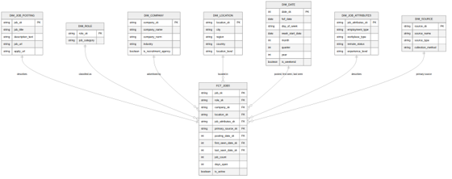

# Data Model — Job Market Data Pipeline (Saudi Arabia)

Target dimensional model for the curated job-market dataset, designed before the intermediate and marts layers were built, following the dimensional modeling process: business questions → business process → grain → dimensions → measures → validation.

|                        |                                                                                                                                         |
|------------------------|-----------------------------------------------------------------------------------------------------------------------------------------|
| **Version**            | 2, 25 September 2026. Changes from version 1 are listed in Section 16                                                                   |
| **Pattern**            | Star schema: **one fact table** (`fct_jobs`, an accumulating snapshot) and six dimensions                                               |
| **Approach**           | ELT — raw data loaded untouched into Snowflake, transformed with dbt                                                                    |
| **Dimension history**  | Type 1 (overwrite). A job opening’s lifecycle is kept as dates on the fact                                                              |
| **Observation window** | September 2026 — our collections in September, starting on 9 September. The last collection of every employer board was on 24 September |
| **Status**             | Staging built on two snapshots · intermediate and marts designed (Section 15)                                                           |

## 1. Analytics goal

Give job seekers, career centers, and workforce analysts a reliable view of hiring demand in Saudi Arabia: where the jobs are, who is hiring, what kind of roles are open, and how demand changes over time.

Data quality is not a business question, but the fact table carries the counts that show it: copies landed, listings merged across sources, and openings with unknown attributes (Section 12.2). The quality page therefore reads the same star, in the MARTS schema, as every other page.

## 2. Business questions

### Time frame

Every question names its period, so each has one correct, checkable answer. Three kinds of period are used, and each question says which one it means:

> **Observation window: September 2026** — the collections we made in September, starting on 9 September. “During September 2026” in a question means during these collections: openings that were advertised and removed before our first collection were never observed. A later collection in September is included without changing any question.

- **Being advertised** in a window: the opening was live on a job board in at least one of our collections in that window (`first_seen_at` on or before the window end, and `last_seen_at` on or after the window start). This says nothing about when the job was **posted**: a job posted in June and still live on 16 September was being advertised in the window. Every collected opening meets this condition. Used by Q1 to Q7.
- **Posted** in a period: the posting’s own date falls in the period. Postings without a posting date (all of Jooble) are left out, because the date we first observed them is a collection date, not a posting date. The last employer-board collection was on Thursday 24 September, so a job posted after it was never observed. Used by Q8 and Q9.
- **Taken down** in a window: the opening disappeared from its employer’s job board between two of our collections (Section 7.2). Only employer boards (ATS sources) give this evidence; a job missing from an aggregator’s search results may simply not have been returned. Used by Q9.

### What is counted

Sources do not report how many vacancies an advertisement covers, so nothing in this model counts vacancies. Three units are used, and each question names its unit:

| **Unit**        | **Meaning**                                                                                                           | **Measure**                  |
|-----------------|-----------------------------------------------------------------------------------------------------------------------|------------------------------|
| **Listing**     | One posting as collected from one source. Workable returns one listing per city                                       | `SUM(listing_count)`         |
| **Job posting** | One advertisement, after its listings on several sources have been merged. Counted once, however many cities it names | `COUNT(DISTINCT posting_sk)` |
| **Job opening** | One job posting in one Saudi location: one row of `fct_jobs`                                                          | `SUM(job_count)`             |

In the Workable sample, 1,029 job postings produce 1,471 listings, because 205 postings name several cities (197 of them from Eram Talent). Grouped by city, postings and openings are equal; at every other level, postings are the right count of “how many jobs”.

### Questions

One idea per question.

| **\#** | **Business question**                                                                                                                                         | **Unit** | **Data availability**                                                                                                                                                                                                                                           |
|--------|---------------------------------------------------------------------------------------------------------------------------------------------------------------|----------|-----------------------------------------------------------------------------------------------------------------------------------------------------------------------------------------------------------------------------------------------------------------|
| Q1     | How many unique job postings were being advertised in Saudi Arabia during September 2026?                                                                     | Postings | All sources                                                                                                                                                                                                                                                     |
| Q2     | Which 10 Saudi cities had the most job openings being advertised during September 2026?                                                                       | Openings | All sources, after city standardization; openings with no known city are excluded                                                                                                                                                                               |
| Q3     | Which 10 employers, excluding recruitment agencies, were advertising the most job postings in Saudi Arabia during September 2026?                             | Postings | All sources; agencies flagged in `dim_company` (Section 6)                                                                                                                                                                                                      |
| Q4     | Which job categories had the most job postings being advertised in Saudi Arabia during September 2026?                                                        | Postings | All sources, via title keywords. Arabic titles fall into `Other` until Arabic keywords are added (Section 14)                                                                                                                                                   |
| Q5     | What percentage of the job postings being advertised in Saudi Arabia during September 2026 were full-time?                                                    | Postings | Not available for Jooble; its postings are Unknown and excluded from the percentage                                                                                                                                                                             |
| Q6     | What percentage of the job postings being advertised in Saudi Arabia during September 2026 were fully remote?                                                 | Postings | Known for Ashby, Workable, SmartRecruiters and JSearch; not available for Jooble or Greenhouse, excluded from the percentage. Hybrid counts as not remote                                                                                                       |
| Q7     | Which experience level was requested most by job postings being advertised in each Saudi region during September 2026, with and without recruitment agencies? | Postings | Workable and SmartRecruiters only. Shown both ways, because two agencies hold 54% of the sampled postings with a known level (Section 14)                                                                                                                       |
| Q8     | How many new job postings were posted in Saudi Arabia in each week of September 2026?                                                                         | Postings | ATS sources only: the only sources collected on the same dates through the month (JSearch’s latest posting date is 10 September; Jooble has no posting date). Weeks run Sunday to Saturday; the first and last weeks are partial (Section 9)                    |
| Q9     | For job openings taken down during September 2026, what was the median number of days between their posting date and their removal?                           | Openings | ATS sources with two snapshots: 130 ATS listings disappeared (Section 12.1); the number of openings is known after matching. Median, because some postings date back to 2018. Per opening, because an employer can close one city of a posting and keep another |

**Salary** is not asked about. None of the four employer-board payloads we collect has a salary field: Ashby returns salary bands only when called with `includeCompensation=true`, and `ashby.py` sets it to `false`. JSearch’s `job_salary_string` is empty in all 3,089 collected rows, and Jooble’s `salary` is free text that is about 96% empty (`source_investigation.md` §3.2), e.g. `"SAR 2500 - 3000 per month"`. The text is kept for display as `salary_text` in `dim_job_posting`, never as a number.

**Skills and technologies** are not modelled, although the brief mentions them: 64% of staged listings are Jooble snippets (8,262 of 12,928; 179 to 284 characters in the sample), many titles and descriptions are in Arabic, and skills are many-to-many with postings, which needs a bridge table next to the star. Section 14 describes the extension.

## 3. Business process

> **Job opening publication:** an employer publishes a job posting for one or more locations, and the pipeline observes it on one or more sources until it disappears.

The star schema measures this process at the level of the job opening: one posting in one location.

## 4. Grain

> `fct_jobs`**: one row represents one job opening — one job posting in one Saudi location, after the listings of the same posting on several sources have been merged into one.**

- **Location.** A city when the source names one; otherwise the region, or Saudi Arabia as a whole (Section 6, `dim_location`).
- **Multi-city postings.** Workable publishes a posting open in several cities as one listing per city, and each city is its own opening. The other sources give one location per listing; when its text names several Saudi cities, the first one is used. This is rare in the samples: one Ashby listing names two cities (`"Riyadh / Jeddah"`) and one more lists them only in `secondaryLocations`, which staging keeps but does not use (2 of 47); one SmartRecruiters listing of 908 says `"Multiple Cities"`; no JSearch, Jooble or Greenhouse row names two Saudi cities.
- **The grain is tested.** `posting_sk` + `location_sk` must be unique in `fct_jobs`. The test fails if two cities of one Workable posting resolve to the same location, for example two cities missing from `seed_city_mapping` that both fall to country level. The samples hold one such posting (As Sulayyil and Al Mubarraz, both to be added to the seed).
- **Expected rows.** Fewer openings than the 12,928 staged listings: the difference is the cross-source overlap resolved by matching (Section 8). Fewer postings than openings: the difference is the extra cities of multi-city postings.
- **Why the opening and not the listing.** Counting listings would count a job published on three sources three times, so “how many jobs were advertised in Riyadh?” would be wrong. The link from each opening back to its listings is kept in `int_jobs_matched` for lineage, and the fact carries the listing counts (Section 7.1), so no second fact table is needed.

### Fact table type

`fct_jobs` is an **accumulating snapshot**: one row per job opening for its whole life, holding several dates (posted, first seen, last seen) that are filled in as they happen. It is a table rebuilt in full on every run; at about 13,000 listings an incremental model is not needed. A periodic snapshot (one row per opening per collection date) would be more precise for week-by-week stock questions, but with two to three collections it adds nothing.

## 5. Schema diagram

One fact table in the center; each dimension joins it with a one-to-many relationship, and `dim_date` joins it three times (posted, first seen, last seen).

Star schema: `fct_jobs`, the only fact table, and its six dimensions

## 6. Dimensions

Every dimension contains exactly one **Unknown member** (`'-1'`, or `-1` for `dim_date`). A fact row whose value is missing points to it instead of carrying a null foreign key, so every `relationships` test holds and reports can group missing values explicitly. Keys are built with `dbt_utils.generate_surrogate_key()`, except the `YYYYMMDD` key of `dim_date`.

### `dim_job_posting` — the advertisement itself

One row per job posting, after merging. It holds the long text, so the fact table stays narrow. A posting open in several cities has one opening per city in the fact: the relationship is one-to-many.

| **Column**              | **Type**    | **Description**                                                                                                                                                               |
|-------------------------|-------------|-------------------------------------------------------------------------------------------------------------------------------------------------------------------------------|
| `posting_sk`            | STRING (PK) | Hash of `source_name` and `source_job_id` of the representative listing (Section 8.3). The city is not part of it, so the cities of one Workable posting share one key        |
| `job_title`             | STRING      | From the representative listing                                                                                                                                               |
| `description_text`      | STRING      | Plain text from the representative listing: HTML entities decoded, tags removed, whitespace collapsed (Section 10). Only a snippet when the posting was found on Jooble alone |
| `job_url` / `apply_url` | STRING      | From the representative listing                                                                                                                                               |
| `salary_text`           | STRING      | Salary as free text when a listing has one (in practice Jooble). Display only                                                                                                 |

### `dim_company` — who is advertising

| **Column**              | **Type**    | **Description**                                                                                                                     |
|-------------------------|-------------|-------------------------------------------------------------------------------------------------------------------------------------|
| `company_sk`            | STRING (PK) | Hash of `company_norm`; `'-1'` when the name is missing or a placeholder                                                            |
| `company_name`          | STRING      | Display name: the standard name from `seed_company_aliases` when listed there, otherwise the name from the highest-priority listing |
| `company_norm`          | STRING      | Matching key: legal suffixes and labels removed, then mapped through `seed_company_aliases`                                         |
| `industry`              | STRING      | Most frequent industry across the company’s listings (Workable / SmartRecruiters only)                                              |
| `is_recruitment_agency` | BOOLEAN     | From `seed_company_aliases`. Agencies advertise on behalf of clients, so Q3 excludes them and Q7 is shown with and without them     |

`seed_company_aliases` maps known spellings of a company to one standard name, and flags agencies. It covers:

- the eleven Ashby board slugs (e.g. `lilt-production` → `Lilt`), because Ashby’s API returns no company name;
- placeholders such as `Private Company` or `Confidential`, mapped to Unknown (`'-1'`);
- aliases and agencies found among the 60 largest companies by listing count, which cover 58% of listings. `Private Company` alone is 13.6% of listings (Jooble and JSearch).

It holds **no Arabic spelling yet**: all 36 aliases are in Latin script, while 12 of the 200 sampled JSearch employer names contain Arabic. Arabic aliases for the largest companies are to be added (Section 15); until then, an Arabic company name matches only the same Arabic name.

### `dim_location` — where

Hierarchy: country → region → city.

| **Column**       | **Type**    | **Description**                                                                   |
|------------------|-------------|-----------------------------------------------------------------------------------|
| `location_sk`    | STRING (PK) | Hash of `city`, `region`, `location_level`                                        |
| `city`           | STRING      | Standard city from `seed_city_mapping`; `'Unknown'` when the source names no city |
| `region`         | STRING      | Standard region (13 Saudi regions); `'Unknown'` when not known                    |
| `country`        | STRING      | `'SA'`                                                                            |
| `location_level` | STRING      | `city`, `region` or `country`: the most precise level the source gave             |

A listing that names only a region (e.g. Jooble’s `"Al Qassim Region"`) keeps its region, so it still counts in region-level answers (Q7). A listing that says only “Saudi Arabia”, or is remote with no city, is at `country` level. The Unknown member is used only when nothing is known.

In the samples, 49 of 200 JSearch cities are written in Arabic (جدة، الدمام), and four Workable cities are missing from the seed (`Udhailiyah`, `Hasa Industrial City`, `As Sulayyil`, `Al Mubarraz`). Arabic spellings match only when `normalize_text()` gives the seed and the lookup the same form. Removing diacritics and tatweel and unifying the alef forms, with the seed’s aliases stored that way, lets one alias cover variants that the seed now lists one by one (King Abdullah Economic City appears with and without shadda and hamza).

### `dim_date` — when

Generated with `dbt_utils.date_spine` from the earliest date in any role (usually an old posting date) to the latest collection date, so every `relationships` test on a date key passes. **Role-playing dimension:** used for posting date, first-seen date and last-seen date. In Power BI it is loaded once per role (Posted Date, First Seen Date, Last Seen Date), each with an active relationship.

| **Column**                   | **Type** | **Description**                                                                                                                                                 |
|------------------------------|----------|-----------------------------------------------------------------------------------------------------------------------------------------------------------------|
| `date_sk`                    | INT (PK) | `YYYYMMDD`                                                                                                                                                      |
| `full_date`                  | DATE     |                                                                                                                                                                 |
| `day_of_week`                | STRING   |                                                                                                                                                                 |
| `week_start_date`            | DATE     | The Sunday that starts the date’s week, matching the Saudi working week. Weekly grouping (Q8) uses this, not a week number, so weeks never collide across years |
| `month` / `quarter` / `year` | INT      |                                                                                                                                                                 |
| `is_weekend`                 | BOOLEAN  | Friday and Saturday                                                                                                                                             |

### `dim_source` — where the representative listing was collected

Six rows plus Unknown, loaded from a new seed, `seed_sources.csv` (Section 10.2), so the values are reviewed in Git instead of hard-coded in SQL.

| **Column**          | **Type**    | **Description**                                                           |
|---------------------|-------------|---------------------------------------------------------------------------|
| `source_sk`         | STRING (PK) | Hash of `source_name`                                                     |
| `source_name`       | STRING      | `workable`, `smartrecruiters`, `ashby`, `greenhouse`, `jsearch`, `jooble` |
| `source_type`       | STRING      | `ATS` (employer job boards) or `Aggregator` (query-based search engines)  |
| `collection_method` | STRING      | `Company board API` or `Query matrix API`                                 |
| `source_priority`   | INT         | 1 to 6: the order used to choose the representative listing (Section 8.4) |

The fact joins it through `primary_source_sk`, the source of the representative listing. All four ATS sources come before both aggregators in `source_priority`, so `source_type = 'ATS'` on this key means the opening has at least one employer-board listing; Q8 and Q9 use this. How many listings each source contributed is carried on the fact itself (Section 7.1).

### `dim_job_attributes` — job classification (junk dimension)

Five short, low-cardinality attributes combined into one dimension, instead of five single-column dimensions. One row per observed combination. The combination in which all five are Unknown **is** the Unknown member (`'-1'`); there is no second all-Unknown row.

| **Column**          | **Type**    | **Values**                                                                                                                                                                                                                             |
|---------------------|-------------|----------------------------------------------------------------------------------------------------------------------------------------------------------------------------------------------------------------------------------------|
| `job_attributes_sk` | STRING (PK) | Hash of the five attributes; `'-1'` when all five are Unknown                                                                                                                                                                          |
| `job_category`      | STRING      | 18 categories from title keywords (`seed_job_categories`); `Other` when the title matches none; `Unknown` when there is no title. Moved here from version 1’s `dim_role`, which held only this column                                  |
| `employment_type`   | STRING      | `Full-time`, `Part-time`, `Contract`, `Internship`, `Temporary`, `Volunteer`, `Other`, `Unknown`                                                                                                                                       |
| `workplace_type`    | STRING      | `Remote`, `Hybrid`, `OnSite`, `Unknown`                                                                                                                                                                                                |
| `remote_status`     | STRING      | `Remote`, `Not remote`, `Unknown`. Taken from `workplace_type` when it is known, otherwise from the source’s remote flag (Section 10). Hybrid is `Not remote`. Used for Q6                                                             |
| `experience_level`  | STRING      | Closed list: `Internship`, `Entry`, `Associate`, `Mid-Senior`, `Director`, `Executive`, `Unknown`, mapped by `seed_experience_levels`. A raw value missing from the seed passes through unchanged and fails the `accepted_values` test |

## 7. Facts and measures

### 7.1 `fct_jobs` — the only fact table

| **Column**                             | **Kind**                   | **Logic**                                                                                                                                                                                              |
|----------------------------------------|----------------------------|--------------------------------------------------------------------------------------------------------------------------------------------------------------------------------------------------------|
| `job_sk`                               | PK                         | Key of the job opening, from `int_jobs_matched` (Section 8.3)                                                                                                                                          |
| `posting_sk`                           | FK                         | Posting of the representative listing                                                                                                                                                                  |
| `company_sk`, `location_sk`            | FK                         | Shared by every listing of the opening, because company and city are part of the match key (Section 8.3)                                                                                               |
| `primary_source_sk`                    | FK                         | Source of the representative listing                                                                                                                                                                   |
| `job_attributes_sk`                    | FK                         | Each attribute chosen across the opening’s listings (Section 8.4)                                                                                                                                      |
| `posting_date_sk`                      | FK (role: posted)          | Earliest posting date of the opening’s ATS listings; when it has none, the earliest of any listing; `-1` when no listing has one                                                                       |
| `first_seen_date_sk`                   | FK (role: first seen)      | `min(first_seen_at)` across the opening’s listings                                                                                                                                                     |
| `last_seen_date_sk`                    | FK (role: last seen)       | `max(last_seen_at)` across the opening’s listings                                                                                                                                                      |
| `job_count`                            | Measure — **additive**     | `1` per row: one job opening                                                                                                                                                                           |
| `listing_count`                        | Measure — **additive**     | Listings merged into the opening; `1` when nothing was merged                                                                                                                                          |
| `listing_count_<source>` (six columns) | Measures — **additive**    | The same count for each source: `_workable`, `_smartrecruiters`, `_ashby`, `_greenhouse`, `_jsearch`, `_jooble`. The six add up to `listing_count`                                                     |
| `copies_landed`                        | Measure — **additive**     | Copies of those listings landed in RAW before within-source deduplication (new staging column, Section 10.1)                                                                                           |
| `source_count`                         | Measure — **non-additive** | Number of distinct sources among the listings, 1 to 6                                                                                                                                                  |
| `days_open`                            | Measure — **non-additive** | Days from the posting date to the last date the opening was observed. Null when there is no posting date. Summarized with a median, never summed. For openings still advertised it means “open so far” |
| `is_active`                            | Flag                       | Whether the opening is still advertised, from employer-board evidence first (Section 7.2)                                                                                                              |

The three date roles make every question’s time frame answerable: “being advertised” uses first seen and last seen, “posted” uses the posting date, and “taken down” uses last seen with `is_active` (Section 2).

Report measures built on these columns:

| **Measure**      | **Definition**               | **Additive**                                                              |
|------------------|------------------------------|---------------------------------------------------------------------------|
| Job openings     | `SUM(job_count)`             | Yes                                                                       |
| Job postings     | `COUNT(DISTINCT posting_sk)` | No: recomputed at every level. Equal to job openings when grouped by city |
| Listings         | `SUM(listing_count)`         | Yes                                                                       |
| Median days open | `MEDIAN(days_open)`          | No                                                                        |

Counting postings as a distinct count of a key on the fact is the usual pattern for a line-level fact, in the same way that orders are counted on an order-line fact table.

### 7.2 Lifecycle: what `is_active = false` means

No source reports whether a posting was filled, closed, or deleted. The pipeline can only see that a listing **disappeared**. The model records the disappearance and does not claim a reason.

| **Source type** | **A listing is inactive when**                                                                                                                       | **Used for Q9** |
|-----------------|------------------------------------------------------------------------------------------------------------------------------------------------------|-----------------|
| ATS             | Missing from the latest collection of its own board. A board’s file lists every open job, so this is direct evidence that the posting was taken down | Yes             |
| Aggregator      | Not returned by any query within 7 days of that source’s latest collection. Queries do not return every job on every run, so this is weak evidence   | No              |

An opening with at least one ATS listing takes its status from its ATS listings only; an opening found only on aggregators takes it from those:

    -- fct_jobs, grouped by job_sk
    case
        when count_if(source_type = 'ATS') > 0
            then boolor_agg(iff(source_type = 'ATS', is_active, null))
        else boolor_agg(is_active)
    end as is_active

Version 1 used “active if any listing is active”, so a job that was gone from its Workable board on 24 September stayed active through a Jooble copy collected on 9 September, and dropped out of Q9. The status is as of each source’s latest collection: 24 September for openings with an ATS listing, 9 September for Jooble-only and 11 September for JSearch-only openings.

The removal date is known only to within the gap between two collections: `last_seen_date` is the last day the opening was still seen.

### 7.3 Non-additive values

Percentages and medians are recalculated from their components, never summed or averaged across groups:

| **Value**                        | **Formula**                                                                                                             |
|----------------------------------|-------------------------------------------------------------------------------------------------------------------------|
| Share of full-time postings (Q5) | `COUNT(DISTINCT posting_sk)` where `employment_type = 'Full-time'` ÷ the same where `employment_type <> 'Unknown'`      |
| Share of remote postings (Q6)    | `COUNT(DISTINCT posting_sk)` where `remote_status = 'Remote'` ÷ the same where `remote_status <> 'Unknown'`             |
| Median days open (Q9)            | `MEDIAN(days_open)` over the filtered openings, with `AVG` shown beside it for reference — never an average of averages |
| Cross-source overlap             | `SUM(job_count)` where `source_count > 1` ÷ `SUM(job_count)`. A lower bound (Section 8.5)                               |

## 8. Cross-source matching specification

Builds `int_jobs_matched`: one row per listing, with the `job_sk` of the opening it belongs to and a flag for the opening’s representative listing. Matching is **heuristic** — sources share no common identifier — so the rules are designed to be explainable and measurable.

### 8.1 The rule that is never broken

> **Two listings from the same publisher are never merged.**

The publisher is whoever actually put the advertisement online:

| **Source type** | **Publisher**                              |
|-----------------|--------------------------------------------|
| ATS             | The employer’s board (the landed file)     |
| JSearch         | `job_publisher` (e.g. LinkedIn, Jobrapido) |
| Jooble          | `underlying_source` (e.g. jobleads.com)    |

If an employer’s board lists two postings with the same title and city under different IDs, the employer says they are two openings, so they stay two. Aggregators are different: they re-collect from other sites, so the same job can reach JSearch once through LinkedIn and once through Jobrapido, under two different `job_uid`s. Those two may be merged; two listings that both came through LinkedIn may not. This prevents the worst error, under-counting real jobs, without double-counting aggregator copies.

### 8.2 Matching keys (built in `int_job_listings`)

| **Key**        | **Rules**                                                                                                                       | **Example**                                                                              |
|----------------|---------------------------------------------------------------------------------------------------------------------------------|------------------------------------------------------------------------------------------|
| `title_norm`   | Lower-case, punctuation removed, bracketed notes removed, hiring noise and location words removed, `sr` / `jr` / `mgr` expanded | `"Senior Oil & Gas Safety Officer (Saudi National)"` → `"senior oil gas safety officer"` |
| `company_norm` | Lower-case, punctuation removed, legal suffixes and labels removed, then mapped through `seed_company_aliases`                  | `"Qiddiya Investment Company"` → `"qiddiya investment"`                                  |
| `city_std`     | Seed lookup on the city field, else on the location text                                                                        | جدة and `Jiddah` → `Jeddah`; Greenhouse `"Riyadh, KSA"` → `Riyadh`                       |

Titles are not translated: an Arabic title matches only the same Arabic title (Section 14).

### 8.3 Matching rule and keys

**Exact match only:** listings match when `title_norm`, `company_norm` and `city_std` are all equal and not null. Listings missing a company or a city are never matched; each stays its own opening.

**No fuzzy matching.** A Jaro-Winkler threshold was tested and rejected: it scores `data analyst` against `data analyst intern` at 92 and `project engineer` against `project engineer trainee` at 93, because it rewards a shared beginning and the word that separates two roles comes last. Exact matching after normalization misses some true duplicates; the reported overlap is therefore a lower bound (Section 8.5).

**Pairing inside a group.** When a group holds several listings from one publisher (e.g. two from the same Workable board and one from Jooble), listings are ranked within each publisher by posting date, then first-seen date, then `source_record_sk`, and paired rank to rank, which keeps the rule in Section 8.1 deterministic. A simpler rule — leave a group unmerged when it holds two listings from one publisher — was considered and rejected: in the samples, 11% of Workable rows (165 of 1,471) and 16% of SmartRecruiters rows (144 of 908) share title, company and city with another posting on the same board, and every aggregator copy of those postings would stay unmerged.

**Keys.**

- `job_sk` (the opening) is the `source_record_sk` of the opening’s anchor, its earliest listing (earliest first-seen date, ties broken by `source_record_sk`). It stays the same across rebuilds as long as the anchor stays in the same opening. A change to the normalization rules can merge or split groups and so change the anchor, which is why reviewed matches are stored as pairs of `source_record_sk` (Section 8.5), never against a `job_sk`.
- `posting_sk` is `generate_surrogate_key(['source_name', 'source_job_id'])` of the representative listing (Section 8.4). For every source except Workable it equals that listing’s `source_record_sk`; for Workable it leaves out the city, so the cities of one posting share it.

### 8.4 Survivorship — which value each field takes

When listings match, one listing represents the opening: the one from the first source in `source_priority` (`seed_sources.csv`): Workable → SmartRecruiters → Ashby → Greenhouse (employer-published) → JSearch → Jooble (snippet-only descriptions). Two listings from the same source (two JSearch publishers, say) are ordered by first-seen date, then `source_record_sk`. Each field then follows its own rule:

| **Field**                                                           | **Rule**                                                                                                                                                                       |
|---------------------------------------------------------------------|--------------------------------------------------------------------------------------------------------------------------------------------------------------------------------|
| `posting_sk`, title, description, URLs, `primary_source_sk`         | From the representative listing                                                                                                                                                |
| `company_sk`, `location_sk`, `job_category`                         | Equal across the opening’s listings, because `company_norm`, `city_std` and `title_norm` are the match key                                                                     |
| `employment_type`, `experience_level`                               | First known value (not `Unknown`) in `source_priority` order                                                                                                                   |
| `workplace_type` with `remote_status`                               | Taken as a pair from the first listing in `source_priority` order whose `remote_status` is known, so the two never contradict each other                                       |
| `salary_text`                                                       | First non-empty value in `source_priority` order                                                                                                                               |
| `posting_date`                                                      | Earliest posting date of the ATS listings; when there is none, the earliest of any listing. JSearch dates are derived from text such as “10 days ago”, so they are approximate |
| `first_seen_at` / `last_seen_at`                                    | Earliest / latest across the listings                                                                                                                                          |
| `industry` (on `dim_company`)                                       | Most frequent value; ties broken by `source_priority`                                                                                                                          |
| `is_active`                                                         | Employer-board evidence first (Section 7.2)                                                                                                                                    |
| `listing_count`, per-source counts, `copies_landed`, `source_count` | Counted or summed over the opening’s listings                                                                                                                                  |

Example: an opening whose representative listing is from Workable (no remote signal beyond `telecommuting = false`) and which also appears on JSearch with `job_is_remote = true` takes `remote_status = 'Not remote'` from Workable, because Workable comes first and its value is known.

### 8.5 Measuring matching quality

| **Check**                | **Method**                                                                                                                                                                                                  |
|--------------------------|-------------------------------------------------------------------------------------------------------------------------------------------------------------------------------------------------------------|
| **Precision**            | Manual review of 40 randomly sampled merged pairs, stored as `listing_a`, `listing_b` (both `source_record_sk`) and `is_same_job` in a seed, so the review survives rebuilds; reported as “X of 40 correct” |
| **Rule 8.1**             | Singular dbt test: no `job_sk` holds two listings from the same publisher                                                                                                                                   |
| **Coverage**             | Every listing belongs to exactly one opening: `SUM(fct_jobs.listing_count)` equals the rows of `int_job_listings`                                                                                           |
| **Independent evidence** | JSearch `job_publisher` and Jooble `underlying_source` sometimes name an ATS (e.g. `smartrecruiters.com`); these listings are checked for a match                                                           |
| **Recall**               | Cannot be measured without a shared identifier. The reported overlap is a **lower bound**                                                                                                                   |

### 8.6 Risks

| **Risk**                                                               | **Effect**                                                                                                                         | **Mitigation**                                                                                                                                     |
|------------------------------------------------------------------------|------------------------------------------------------------------------------------------------------------------------------------|----------------------------------------------------------------------------------------------------------------------------------------------------|
| Company names differ between sources (Arabic / English, abbreviations) | Missed matches: matching only compares listings of the same company, so an unresolved company blocks all of its jobs from matching | `seed_company_aliases`, built from the 60 largest companies, plus Arabic aliases (to add); share of listings resolved through the seed is reported |
| Recruitment agencies post on behalf of clients                         | No match with the client’s own listing; agencies would dominate Q3 and Q7                                                          | `is_recruitment_agency`; Q3 excludes agencies, Q7 is shown with and without them                                                                   |
| Very generic titles (`"Sales Executive"`)                              | Possible false merges                                                                                                              | Exact match within the same company and city only                                                                                                  |

## 9. Validation against the business questions

“Advertised in the window” below means `first_seen_date_sk <= 20260930` and `last_seen_date_sk >= 20260901` (Section 2).

| **\#** | **Question**                        | **How the model answers it**                                                                                                                                                                                                                                                                                                                                                                                                     |
|--------|-------------------------------------|----------------------------------------------------------------------------------------------------------------------------------------------------------------------------------------------------------------------------------------------------------------------------------------------------------------------------------------------------------------------------------------------------------------------------------|
| Q1     | Postings advertised, Sep 2026       | `COUNT(DISTINCT posting_sk)` from `fct_jobs`, advertised in the window                                                                                                                                                                                                                                                                                                                                                           |
| Q2     | Top 10 cities                       | `SUM(job_count)`, advertised in the window, grouped by `dim_location.city` where `location_level = 'city'`, top 10                                                                                                                                                                                                                                                                                                               |
| Q3     | Top 10 employers                    | Q1 where `dim_company.is_recruitment_agency = false` and `company_sk <> '-1'`, grouped by `company_name`, top 10                                                                                                                                                                                                                                                                                                                 |
| Q4     | Job categories                      | Q1 grouped by `dim_job_attributes.job_category`                                                                                                                                                                                                                                                                                                                                                                                  |
| Q5     | Share full-time                     | Q1 split by `dim_job_attributes.employment_type`; full-time ÷ all known types                                                                                                                                                                                                                                                                                                                                                    |
| Q6     | Share remote                        | Q1 split by `dim_job_attributes.remote_status`; remote ÷ (remote + not remote)                                                                                                                                                                                                                                                                                                                                                   |
| Q7     | Top experience level per region     | Q1 grouped by `dim_location.region` and `dim_job_attributes.experience_level` (Unknown excluded on both); highest count per region. Run twice: all companies, and `is_recruitment_agency = false`                                                                                                                                                                                                                                |
| Q8     | New postings per week               | `COUNT(DISTINCT posting_sk)` grouped by `dim_date.week_start_date` on `posting_date_sk`, for posting dates from 1 to 24 September 2026, where `dim_source.source_type = 'ATS'` on `primary_source_sk`. The week starting 30 August covers 1–5 September only, and the week starting 20 September ends at the last collection on Thursday 24 September; both are labelled partial. The week starting 27 September is not reported |
| Q9     | Median days from posting to removal | `MEDIAN(days_open)` where `is_active = false`, `dim_source.source_type = 'ATS'` on `primary_source_sk`, `last_seen_date_sk` between 20260901 and 20260930, and `posting_date_sk <> -1`                                                                                                                                                                                                                                           |

Q3 as a query on the star:

    select
        c.company_name,
        count(distinct f.posting_sk) as job_postings
    from fct_jobs as f
    inner join dim_company as c
        on f.company_sk = c.company_sk
    where f.first_seen_date_sk <= 20260930
      and f.last_seen_date_sk >= 20260901
      and not c.is_recruitment_agency
      and c.company_sk <> '-1'
    group by c.company_sk, c.company_name
    order by job_postings desc
    limit 10

Power BI connects to the MARTS schema only, and the same measures are written in DAX:

    Job openings     = SUM ( fct_jobs[job_count] )
    Job postings     = DISTINCTCOUNT ( fct_jobs[posting_sk] )
    Listings         = SUM ( fct_jobs[listing_count] )
    Median days open = MEDIAN ( fct_jobs[days_open] )

## 10. Source-to-target mapping

| **Target table**     | **Target column**                         | **Source**                                                                                                                                                                                                | **Logic**                                                                                                                                                                                                                                      |
|----------------------|-------------------------------------------|-----------------------------------------------------------------------------------------------------------------------------------------------------------------------------------------------------------|------------------------------------------------------------------------------------------------------------------------------------------------------------------------------------------------------------------------------------------------|
| `dim_company`        | `company_name`                            | Ashby: board slug · Workable: `raw_data:name` · Greenhouse: `metadata.Brand`, else `company_name` without “Careers page” · SmartRecruiters: `company.name` · JSearch: `employer_name` · Jooble: `company` | `seed_company_aliases` standard name when listed; otherwise the highest-priority listing’s name                                                                                                                                                |
| `dim_company`        | `is_recruitment_agency`                   | `seed_company_aliases`                                                                                                                                                                                    | `false` when the company is not in the seed                                                                                                                                                                                                    |
| `dim_company`        | `industry`                                | Workable `industry` · SmartRecruiters `industry.label`                                                                                                                                                    | Most frequent value per company                                                                                                                                                                                                                |
| `dim_location`       | `city`, `region`, `location_level`        | `city_raw` (Workable, SmartRecruiters, JSearch, Ashby address) or `location_raw` text (Greenhouse, Jooble, Ashby)                                                                                         | Whole-word lookup in `seed_city_mapping`, city field before location text. The seed also holds region names with an empty city (`al qassim region` → Qassim), so a region-only text is kept at region level; if nothing matches, country level |
| `dim_job_attributes` | `job_category`                            | `title_raw`, via `title_norm`                                                                                                                                                                             | Whole-word keyword lookup in `seed_job_categories`. The lowest priority wins; ties go to the longer keyword, then to the category name. `Other` when nothing matches (query below)                                                             |
| `dim_job_attributes` | `employment_type`                         | Ashby `employmentType` · Workable `employment_type` · Greenhouse `metadata['Employment Type']` · SmartRecruiters `typeOfEmployment.label` · JSearch `job_employment_type`                                 | `normalize_employment_type()`; null → Unknown                                                                                                                                                                                                  |
| `dim_job_attributes` | `workplace_type`                          | Ashby `workplaceType` · SmartRecruiters `location.remote` / `hybrid` · Workable `telecommuting = true` and JSearch `job_is_remote = true` (as Remote)                                                     | Staging’s `workplace_type_raw`; null → Unknown                                                                                                                                                                                                 |
| `dim_job_attributes` | `remote_status`                           | `workplace_type`, then Ashby `isRemote` · Workable `telecommuting` · JSearch `job_is_remote`                                                                                                              | `workplace_type` first, flags second (query below)                                                                                                                                                                                             |
| `dim_job_attributes` | `experience_level`                        | Workable `experience` · SmartRecruiters `experienceLevel.label`                                                                                                                                           | `seed_experience_levels` (Section 10.2), joined on `lower(trim(raw value))`; null → Unknown; a value missing from the seed passes through unchanged                                                                                            |
| `dim_job_posting`    | `description_text`                        | `description_plain` from each staging model                                                                                                                                                               | Decode HTML entities (`&amp;` last), then strip tags, then collapse whitespace                                                                                                                                                                 |
| `dim_job_posting`    | `salary_text`                             | Jooble `salary` (JSearch’s field is always empty)                                                                                                                                                         | Trimmed text                                                                                                                                                                                                                                   |
| `dim_source`         | all columns                               | `seed_sources.csv`                                                                                                                                                                                        | One row per source                                                                                                                                                                                                                             |
| `dim_date`           | `date_sk`                                 | `posting_date_raw`, `first_seen_at`, `last_seen_at`                                                                                                                                                       | `to_char(date, 'YYYYMMDD')::int`; null → `-1`                                                                                                                                                                                                  |
| `fct_jobs`           | `job_count`                               | `int_jobs_matched`                                                                                                                                                                                        | `1` per `job_sk`                                                                                                                                                                                                                               |
| `fct_jobs`           | `listing_count`, `listing_count_<source>` | `int_jobs_matched`                                                                                                                                                                                        | `count(*)` and `count_if(source_name = '<source>')` per `job_sk`                                                                                                                                                                               |
| `fct_jobs`           | `copies_landed`                           | `stg_*.copies_landed`                                                                                                                                                                                     | `sum` per `job_sk`                                                                                                                                                                                                                             |
| `fct_jobs`           | `source_count`                            | `int_jobs_matched`                                                                                                                                                                                        | `count(distinct source_name)` per `job_sk`                                                                                                                                                                                                     |
| `fct_jobs`           | `days_open`                               | posting date (Section 8.4), latest `last_seen_at`                                                                                                                                                         | `datediff('day', posting_date, max(last_seen_at))` per `job_sk`; null when there is no posting date                                                                                                                                            |
| `fct_jobs`           | `is_active`                               | `int_job_listings.is_active`                                                                                                                                                                              | Section 7.2                                                                                                                                                                                                                                    |

The two rules that need more than one line:

    -- int_job_listings: remote_status
    case
        when workplace_type = 'Remote' then 'Remote'
        when workplace_type in ('Hybrid', 'OnSite') then 'Not remote'
        when coalesce(is_remote, telecommuting) = true then 'Remote'
        when coalesce(is_remote, telecommuting) = false then 'Not remote'
        else 'Unknown'
    end as remote_status
    -- int_job_listings: one category per listing, deterministic when two categories tie
    select
        l.source_record_sk,
        case
            when l.title_norm is null then 'Unknown'
            else coalesce(c.job_category, 'Other')
        end as job_category
    from listings as l
    left join {{ ref('seed_job_categories') }} as c
        on contains(' ' || l.title_norm || ' ', ' ' || c.keyword || ' ')
    qualify row_number() over (
        partition by l.source_record_sk
        order by c.priority, length(c.keyword) desc, c.job_category
    ) = 1

### 10.1 Changes made in staging (25 September)

| **Model**                  | **Change**                                                                                                    | **Why**                                                                                                                                        |
|----------------------------|---------------------------------------------------------------------------------------------------------------|------------------------------------------------------------------------------------------------------------------------------------------------|
| `stg_jsearch_jobs`         | Add `job_json:job_is_remote::boolean as is_remote`                                                            | Only `true` is kept today (as `workplace_type_raw = 'Remote'`), so a JSearch job marked not remote becomes Unknown and leaves Q6’s denominator |
| All six `stg_*`            | Add `count(*) over (partition by <model key>) as copies_landed` next to `first_seen_at`, before the `qualify` | Keeps within-source duplicates visible in the marts (Section 12.2)                                                                             |
| `stg_jsearch_jobs` (tests) | `accepted_values: ['SA']` on `country_raw`                                                                    | Section 12 lists this check, but no test enforces it yet                                                                                       |

### 10.2 Seeds used by the marts

`seed_experience_levels` — raw values observed in staging, mapped to the closed list:

| **Raw value (Workable / SmartRecruiters)** | `experience_level` |
|--------------------------------------------|--------------------|
| `Internship`                               | Internship         |
| `Entry level` / `Entry Level`              | Entry              |
| `Associate`                                | Associate          |
| `Mid-Senior level` / `Mid-Senior Level`    | Mid-Senior         |
| `Director`                                 | Director           |
| `Executive`                                | Executive          |
| `Not Applicable`, empty, null              | Unknown            |

`seed_sources` (new) — one row per source; `source_priority` drives survivorship:

| `source_name`     | `source_type` | `collection_method` | `source_priority` |
|-------------------|---------------|---------------------|-------------------|
| `workable`        | ATS           | Company board API   | 1                 |
| `smartrecruiters` | ATS           | Company board API   | 2                 |
| `ashby`           | ATS           | Company board API   | 3                 |
| `greenhouse`      | ATS           | Company board API   | 4                 |
| `jsearch`         | Aggregator    | Query matrix API    | 5                 |
| `jooble`          | Aggregator    | Query matrix API    | 6                 |

## 11. ELT build steps and load order

| **Step**                               | **Implementation**                                                                                                                                                                                                 | **Status**                                                                |
|----------------------------------------|--------------------------------------------------------------------------------------------------------------------------------------------------------------------------------------------------------------------|---------------------------------------------------------------------------|
| 1\. Stage source data                  | `stg_*` — one model per source: rename, cast, flatten, deduplicate within source, enforce Saudi scope                                                                                                              | ✅ Built, including the additions in Section 10.1                         |
| 2\. Join and filter records            | `int_job_listings` — `union all` of the six staging models on one shared column list, written out so each source’s own columns (Greenhouse brand, Workable telecommuting, JSearch publisher) are mapped explicitly | Written, but not in branch `rimaz-reorg-pipeline`; to update (Section 15) |
| 3\. Business rules and standardization | `int_job_listings` — HTML cleaning; city, region, category, company and experience through seeds; `publisher`, `remote_status`, `posting_sk`                                                                       | Seeds loaded and tested                                                   |
| 4\. Matching and survivorship          | `int_jobs_matched` — `job_sk` and the representative listing (Section 8)                                                                                                                                           | Designed                                                                  |
| 5\. Load dimension tables              | The six `dim_*`                                                                                                                                                                                                    | Designed                                                                  |
| 6\. Load fact table                    | `fct_jobs`                                                                                                                                                                                                         | Designed                                                                  |
| 7\. Data quality checks                | `dbt build`: tests at every layer                                                                                                                                                                                  | ✅ Staging and seeds                                                      |
| 8\. Hand-over                          | Marts exported to `final_datasets/` with a README: columns, row counts, generation date                                                                                                                            | Planned                                                                   |

Load order:

    raw_* --> stg_* --> int_job_listings --> int_jobs_matched --> dim_* --> fct_jobs
                              ^
           seed_city_mapping -+
         seed_job_categories -+
        seed_company_aliases -+
      seed_experience_levels -+
                seed_sources -+

Each layer builds into its own schema, so Power BI can be limited to MARTS. The intermediate models are tables, because every mart reads the matching result:

    # dbt_project.yml
    models:
      job_pipeline:
        staging:
          +materialized: view
          +schema: staging
        intermediate:
          +materialized: table
          +schema: intermediate
        marts:
          +materialized: table
          +schema: marts

A `generate_schema_name` macro keeps the exact names (`STAGING`, `INTERMEDIATE`, `MARTS`) on the `prod` target and on every other one; seeds build into SEEDS. Prefixing the names with the developer’s schema on non-prod targets was not used: the dev target schema is already STAGING, so it would give STAGING_STAGING and STAGING_MARTS.

## 12. Data quality checks

Data quality is tested at every layer and shown from the star (Section 12.2).

| **Check type**        | **Check**                                                                                                                                | **Layer**    | **Status**                           |
|-----------------------|------------------------------------------------------------------------------------------------------------------------------------------|--------------|--------------------------------------|
| Row count             | RAW → staging counts per source recorded (Section 12.1)                                                                                  | staging      | ✅                                   |
| Duplicate             | `unique` on every staging key; Workable on shortcode + city                                                                              | staging      | ✅                                   |
| Null                  | `not_null` on keys, `ingest_date`, `is_active`; warning on titles                                                                        | staging      | ✅                                   |
| Accepted values       | `employment_type`, `workplace_type_raw`, `country_raw`                                                                                   | staging      | ✅                                   |
| Scope                 | Saudi-only filter on Ashby (country field) and Greenhouse (location keywords); `country_raw = 'SA'` on JSearch                           | staging      | ✅ (JSearch test added 25 September) |
| Business rule         | `first_seen_at <= last_seen_at`                                                                                                          | staging      | ✅ Tested on two snapshots           |
| Seeds                 | `unique` / `not_null` on every seed key; `accepted_values` on `experience_level`                                                         | seeds        | ✅                                   |
| Row count             | `int_job_listings` rows = sum of the six staging models                                                                                  | intermediate | Planned                              |
| Duplicate             | `unique` / `not_null` on `source_record_sk` in `int_job_listings` and `int_jobs_matched`                                                 | intermediate | Planned                              |
| Matching              | No `job_sk` holds two listings from the same publisher                                                                                   | intermediate | Planned                              |
| Primary key           | `unique` / `not_null` on the key of `fct_jobs` and of every dimension                                                                    | marts        | Planned                              |
| Grain                 | `posting_sk` + `location_sk` unique in `fct_jobs`                                                                                        | marts        | Planned                              |
| Referential integrity | `not_null` and `relationships` on every foreign key of `fct_jobs`                                                                        | marts        | Planned                              |
| Unknown member        | Exactly one Unknown row in every dimension                                                                                               | marts        | Planned                              |
| Accepted values       | `source_type`, `location_level`, `job_category`, `employment_type`, `workplace_type`, `remote_status`, `experience_level`                | marts        | Planned                              |
| Reconciliation        | `SUM(listing_count)` = rows of `int_job_listings`; the six per-source counts add up to `listing_count`; `copies_landed >= listing_count` | marts        | Planned                              |
| Business rule         | `days_open >= 0` when not null; `first_seen_date_sk <= last_seen_date_sk`                                                                | marts        | Planned                              |
| Text                  | `description_text` holds no HTML tag or entity (`
`, `&lt;`, `&amp;`)                                                                  | marts        | Planned                              |

Excerpt of the marts tests (dbt 1.10+ syntax, as in `seeds/schema.yml`):

    models:
      - name: fct_jobs
        data_tests:
          - dbt_utils.unique_combination_of_columns:
              arguments:
                combination_of_columns:
                  - posting_sk
                  - location_sk
        columns:
          - name: job_sk
            data_tests:
              - unique
              - not_null
          - name: posting_sk
            data_tests:
              - not_null
              - relationships:
                  arguments:
                    to: ref('dim_job_posting')
                    field: posting_sk
          - name: days_open
            data_tests:
              - dbt_utils.accepted_range:
                  arguments:
                    min_value: 0
      - name: dim_company
        columns:
          - name: company_sk
            data_tests:
              - unique
              - not_null
              - has_one_unknown_member

`has_one_unknown_member` is a small generic test (`dim_date` passes `unknown_value: -1`):

    -- tests/generic/has_one_unknown_member.sql
    
    select count(*) as unknown_rows
    from {{ model }}
    where {{ column_name }} = {{ unknown_value }}
    having count(*) <> 1
    

### 12.1 Pipeline audit — RAW to staging

Recorded 2026-09-25, on two snapshots per ATS source. RAW rows count every landed copy of every posting across all snapshots.

| **Source**      | **Snapshots**          | **RAW rows** | **Staging rows** | **Removed** | **Why removed**                                                                                                                 |
|-----------------|------------------------|--------------|------------------|-------------|---------------------------------------------------------------------------------------------------------------------------------|
| Ashby           | 2026-09-16, 2026-09-24 | 94           | 49               | 45          | Same posting in both snapshots; non-Saudi posting (`"Thailand (Remote)"`)                                                       |
| Greenhouse      | 2026-09-09, 2026-09-24 | 356          | 215              | 141         | Same posting in both snapshots or on two boards; **24 non-Saudi postings** (Dubai, Cairo…) from the unfiltered 2026-09-09 files |
| SmartRecruiters | 2026-09-19, 2026-09-24 | 1,825        | 943              | 882         | Same posting in both snapshots                                                                                                  |
| Workable        | 2026-09-16, 2026-09-24 | 2,950        | 1,535            | 1,415       | Same posting (shortcode + city) in both snapshots                                                                               |
| Jooble          | 2026-09-09             | 14,010       | 8,262            | 5,748       | Copies from overlapping queries                                                                                                 |
| JSearch         | 2026-09-10, 2026-09-11 | 3,089        | 1,924            | 1,165       | Copies from overlapping `date_posted` windows                                                                                   |
| **Total**       |                        | **22,324**   | **12,928**       | **9,396**   |                                                                                                                                 |

Status of the staged ATS postings after the second snapshot:

| **Source**      | **Staged** | **Active** | **Disappeared** |
|-----------------|------------|------------|-----------------|
| Ashby           | 49         | 46         | 3               |
| Greenhouse      | 215        | 170        | 45              |
| SmartRecruiters | 943        | 917        | 26              |
| Workable        | 1,535      | 1,479      | 56              |

Active counts equal the postings each extraction script collected on 2026-09-24. The 130 disappeared listings are the input of Q9; after matching, Q9 counts openings, so its base can change slightly.

This section is the single source of these numbers. The audit query is to be kept as `analyses/pipeline_audit.sql`, so it can be re-run after every collection, and `dbt/README.md` should point here instead of repeating its older table (12,797 listings, dated 23 September).

### 12.2 Quality measures from the star

Version 1 proposed an optional `mart_pipeline_quality` table outside the star. It is dropped: the quality page reads `fct_jobs` and its dimensions like every other page, and MARTS keeps a single fact table.

| **Quality question**                                                              | **Measure**                                                                                                                                                                                 |
|-----------------------------------------------------------------------------------|---------------------------------------------------------------------------------------------------------------------------------------------------------------------------------------------|
| How many landed copies repeated a listing (later snapshots, overlapping queries)? | `SUM(copies_landed) − SUM(listing_count)`                                                                                                                                                   |
| How many listings did matching merge into another listing’s opening?              | `SUM(listing_count) − SUM(job_count)`                                                                                                                                                       |
| How many openings were found on more than one source?                             | `SUM(job_count)` where `source_count > 1`                                                                                                                                                   |
| What does each source contribute, and how much of it is also found elsewhere?     | `SUM(listing_count_<source>)`, split by `source_count = 1` or `> 1`                                                                                                                         |
| How complete is each attribute?                                                   | Share of openings on an Unknown value — `company_sk = '-1'`, `location_level <> 'city'`, `employment_type`, `remote_status`, `experience_level`, `posting_date_sk = -1` — by primary source |
| How fresh is the data?                                                            | Latest last-seen date by primary source                                                                                                                                                     |
| How many openings were taken down?                                                | `SUM(job_count)` where `is_active = false`, by `source_type`                                                                                                                                |

Figures that exist only before the marts — RAW rows, failed pages, out-of-scope rows — stay in the audit (Section 12.1).

## 13. Design decisions

| **Decision**                                             | **Reason**                                                                                                                                                                                |
|----------------------------------------------------------|-------------------------------------------------------------------------------------------------------------------------------------------------------------------------------------------|
| One fact table, `fct_jobs`                               | One grain answers every business question and the quality page. Listing-level lineage stays in `int_jobs_matched`; a second fact or a bridge table would add joins without adding answers |
| Grain: a job posting in one location                     | Workable publishes a multi-city posting as one listing per city; keeping the city makes city rankings right, and a distinct count of `posting_sk` still counts each posting once          |
| `dim_job_posting` at posting grain                       | Keeps long text out of the fact. One posting has one or more openings, so it is a real one-to-many dimension, not a copy of the fact’s key                                                |
| `job_category` in the junk dimension                     | A dimension with one column is an attribute, not a dimension (version 1’s `dim_role`)                                                                                                     |
| Per-source listing counts on the fact                    | Show source coverage and overlap from the one fact. The six sources are fixed; a seventh would add one column                                                                             |
| Accumulating snapshot                                    | One row per opening for its whole life, with its dates as columns; enough for questions over one month                                                                                    |
| Employer-board evidence decides `is_active`              | A board’s file lists every open job; an aggregator copy from 9 September must not keep open a job that was gone from its board on 24 September                                            |
| ATS posting date first                                   | Employers publish exact dates; JSearch derives dates from text such as “10 days ago”                                                                                                      |
| Hybrid counts as not remote                              | The same answer for Ashby and SmartRecruiters; Q6 asks about fully remote jobs                                                                                                            |
| A stated period and unit in every question               | Each question has one correct, checkable answer                                                                                                                                           |
| One idea per question                                    | Each question maps to one measure and one grouping, so each result is a single number or ranking                                                                                          |
| Closed vocabularies through seeds                        | Experience levels, categories, companies, cities and sources are reviewable in Git, and an unmapped value fails a test instead of passing silently                                        |
| Surrogate keys from `dbt_utils.generate_surrogate_key()` | Source IDs collide across sources                                                                                                                                                         |
| `job_sk` anchored on the earliest listing                | Stable while the anchor stays in its opening; reviewed matches are stored by `source_record_sk`, which never changes                                                                      |
| Exact matching only                                      | Fuzzy similarity merged different seniority levels of the same role; a lower-bound overlap is preferred to false merges                                                                   |
| Never merge within a publisher; pair rank to rank        | Keeps an employer’s own duplicate-looking postings apart, while still merging their aggregator copies                                                                                     |
| Q9 on ATS evidence only                                  | Only an employer board shows that a posting was taken down                                                                                                                                |
| Unknown member in every dimension                        | No null foreign keys; missing values are visible in reports                                                                                                                               |
| Type 1 dimensions                                        | Sufficient for this scope; the lifecycle lives on the fact’s dates                                                                                                                        |
| One schema per layer; intermediate as tables             | Power BI reads MARTS only; matching runs once per build                                                                                                                                   |

## 14. Known limitations

- **Cross-source overlap is a lower bound.** Exact matching misses some duplicates, and recall cannot be measured without a shared identifier.
- **Partial field coverage.** Experience level exists only in Workable and SmartRecruiters (about 14% of listings: 1,792 with a known level), so Q7 describes those sources’ postings. Jooble has no posting date, employment type or workplace signal; Greenhouse has no workplace signal.
- **Recruitment agencies advertise for clients.** Eram Talent (over half of Workable) and Jobs for Humanity (over half of SmartRecruiters) are flagged and excluded from Q3, but their postings count in every other question. In the samples they hold 785 of the 1,446 postings with a known experience level (54%), so Q7 is shown with and without agencies.
- **JSearch was collected only on 10 and 11 September** (latest posting date: 10 September). Counting it in Q8 would show a false drop after 11 September, so Q8 uses ATS sources only. A JSearch collection after 24 September would allow it to be added back.
- **The last employer-board collection was on 24 September.** A job posted after it was never observed, so the week starting 20 September is partial in Q8 and later weeks are not reported. Aggregator-only openings have their `is_active` as of 9 September (Jooble) and 11 September (JSearch).
- **Very old postings.** ATS postings date back to 2018 (SmartRecruiters) and 2024 (Workable); the median posting was 94–137 days old when first collected. Q9 therefore reports the median.
- **About 20% of titles are uncategorized** because they are generic (`Specialist`, `Supervisor`). Ties between two categories of equal priority are resolved by keyword length, then name: 48 of the 2,832 sampled titles (1.7%) tie, most between Engineering and Operations (e.g. `Planning Engineer`).
- **Arabic text.** The category seed has no Arabic keyword, so all 24 Arabic-only titles in the samples fall into `Other`; the company seed has no Arabic alias; and titles are not translated, so an Arabic listing matches only the same Arabic title. About 20 Arabic keywords (e.g. محاسب، مهندس، ممرض، مبيعات) and Arabic aliases for the largest companies are planned.
- **Multi-city text.** A listing that names several Saudi cities in one text is assigned the first one; the others are not counted separately (2 of 47 Ashby listings in the samples).
- **Source data errors.** Some SmartRecruiters postings carry a Saudi country code with a city of Warsaw, Paris or New York, and a JSearch posting has `job_city = "Huntersville"` with `job_country = "SA"`; they appear at country level.
- **Geographic filtering at extraction.** Ashby, Workable and Greenhouse were filtered to Saudi postings before landing, so a posting whose primary location is abroad but lists a Saudi city as a secondary location was not collected.
- **Closed or deleted cannot be told apart.** No source reports a posting’s status; the model records only that it disappeared (Section 7.2), and only ATS disappearances are used.
- **The removal date is approximate** to within the gap between two collections.
- **New-opening trends only see jobs still open when collected.** A job posted and removed before our first collection was never observed, so Q8 is limited to September 2026.
- **Greenhouse files landed on 2026-09-09 were not filtered at extraction.** The scope filter in `stg_greenhouse_jobs` removed 24 non-Saudi postings.
- **The first snapshot’s folder dates were set by hand at upload.** `first_seen_at` for those postings depends on the folder date being correct.
- **Jooble descriptions are snippets**, not full descriptions.
- **Salary is text only.** No employer-board payload we collect has a salary field (Ashby’s is switched off by `includeCompensation=false`), JSearch’s is always empty, and Jooble’s is mostly empty free text. It is shown as `salary_text`, not analysed.
- **Skills and technologies are not extracted.** A later extension would add `seed_skills` (keyword → skill), `dim_skill`, and a bridge table `bridge_posting_skill` (`posting_sk`, `skill_sk`), matched on ATS descriptions only, since Jooble gives snippets.

## 15. Build status

| **Object**                                                                                              | **Status**                                                                                                                                                                                                                                                                                                                                                                     |
|---------------------------------------------------------------------------------------------------------|--------------------------------------------------------------------------------------------------------------------------------------------------------------------------------------------------------------------------------------------------------------------------------------------------------------------------------------------------------------------------------|
| `stg_*` (6)                                                                                             | ✅ Built on two snapshots, all tests passing. Added on 25 September: `is_remote` on JSearch, `copies_landed` on all six, the `country_raw = 'SA'` test on JSearch (Section 10.1)                                                                                                                                                                                               |
| Seeds (4): `seed_city_mapping`, `seed_job_categories`, `seed_company_aliases`, `seed_experience_levels` | ✅ Loaded, 10 tests passing. Jooble locations checked against the city seed; the 11 unmatched values (Al Qassim Region, Duba, AMAALA…) were added. Only `saudi arabia` and `remote` should remain unmatched (re-check pending). The four Workable cities (Section 6) were added to the seed on 25 September. To add: about 20 Arabic category keywords, Arabic company aliases |
| `seed_sources`                                                                                          | ✅ Loaded and tested (Section 10.2)                                                                                                                                                                                                                                                                                                                                            |
| Macros `normalize_text()`, `normalize_company()`, `strip_html()`                                        | Referenced by the seed descriptions and this document; not in this branch                                                                                                                                                                                                                                                                                                      |
| Macro `generate_schema_name()` and `tests/generic/has_one_unknown_member.sql`                           | generate_schema_name ✅ added and in use; has_one_unknown_member to add with the marts                                                                                                                                                                                                                                                                                         |
| `int_job_listings`                                                                                      | Written, but not in branch `rimaz-reorg-pipeline`; to update with `publisher`, `remote_status`, `location_level`, `posting_sk`, the company and experience seed joins, and the category tie-break                                                                                                                                                                              |
| `int_jobs_matched`                                                                                      | Designed (Section 8)                                                                                                                                                                                                                                                                                                                                                           |
| `dim_job_posting`, `dim_company`, `dim_location`, `dim_date`, `dim_source`, `dim_job_attributes`        | Designed (Section 6)                                                                                                                                                                                                                                                                                                                                                           |
| `fct_jobs`                                                                                              | Designed (Section 7)                                                                                                                                                                                                                                                                                                                                                           |
| `final_datasets/`                                                                                       | Planned (Section 11)                                                                                                                                                                                                                                                                                                                                                           |

## 16. Changes from version 1

| **Area**                   | **Version 1**                                                                                                                        | **Version 2**                                                                                              | **Reason**                                                                     |
|----------------------------|--------------------------------------------------------------------------------------------------------------------------------------|------------------------------------------------------------------------------------------------------------|--------------------------------------------------------------------------------|
| Fact table                 | `fct_jobs`                                                                                                                           | `fct_jobs`, still the only fact, now with `posting_sk`, listing counts, `copies_landed` and `source_count` | One fact answers the business and the quality questions                        |
| What Q1 counts             | Rows (a posting × a city), called unique openings                                                                                    | `COUNT(DISTINCT posting_sk)`; rows are openings                                                            | Workable sample: 1,029 postings, 1,471 listings                                |
| `dim_role`                 | A dimension with one column                                                                                                          | Removed; `job_category` moved to `dim_job_attributes`                                                      | A one-column dimension is an attribute                                         |
| `dim_job_posting`          | 1:1 with the fact                                                                                                                    | One row per posting, one-to-many                                                                           | The cities of one posting share its text                                       |
| `is_active`                | Active if any listing is active                                                                                                      | Employer-board evidence first                                                                              | Aggregator copies kept closed jobs open and out of Q9                          |
| `remote_status`            | From the remote flags                                                                                                                | `workplace_type` first, then the flags; Hybrid is Not remote                                               | Ashby sends Hybrid with `isRemote = true` (4 of 47 sampled listings)           |
| JSearch remote flag        | Only `true` kept in staging                                                                                                          | `is_remote` boolean added                                                                                  | `false` became Unknown                                                         |
| Posting date               | Earliest across listings                                                                                                             | ATS date first                                                                                             | JSearch dates are approximate                                                  |
| Category ties              | Lowest priority wins, no tie-break                                                                                                   | Then the longer keyword, then the name                                                                     | 48 of 2,832 sampled titles tie                                                 |
| Unmapped experience values | Said to fail a test, but mapped to Unknown                                                                                           | Pass through, so the test fails                                                                            | New values stay visible                                                        |
| HTML                       | `strip_html()`                                                                                                                       | Decode entities, strip tags, collapse whitespace; tested                                                   | Greenhouse sends `&lt;p&gt;`                                                   |
| `mart_pipeline_quality`    | Optional table outside the star                                                                                                      | Removed; quality measures come from `fct_jobs`                                                             | One fact; Power BI reads MARTS only                                            |
| `dim_source`               | Values with no upstream                                                                                                              | `seed_sources.csv`, with `source_priority`                                                                 | Reviewable and testable                                                        |
| Marts tests                | `relationships`, `accepted_values`, business rules                                                                                   | Plus primary keys, foreign keys `not_null`, grain, Unknown member, reconciliation, HTML                    | `unique` and `not_null` on every primary key                                   |
| Schemas                    | One schema for every layer                                                                                                           | STAGING, INTERMEDIATE, MARTS; intermediate as tables                                                       | Power BI limited to MARTS                                                      |
| Q7, Q8, Q9                 | —                                                                                                                                    | Q7 with and without agencies; partial weeks marked in Q8; Q9 per opening after matching                    | Agencies hold 54% of Q7’s base in the samples; last collection on 24 September |
| Corrected statements       | Company seed “covers Arabic and English spellings”; “no ATS source has a salary field”; `job_sk` “does not change” when rules change | Corrected in Sections 6, 2 and 8.3                                                                         | Not supported by the seed, the extraction script or the matching rules         |
| Scope                      | Skills not mentioned                                                                                                                 | Declared out of scope, with an extension path                                                              | The brief lists skills and technologies                                        |